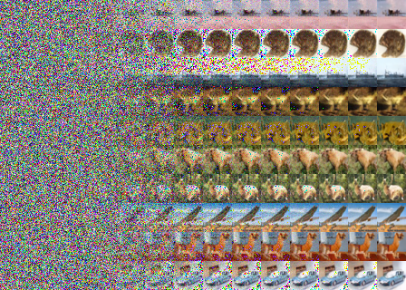

# Diffusion Image generation - with different backbones

All training was done on a singe Nvidia RTX 4090 GPU in ~24 hrs per experiment - All code made from scratch, using pytorch

### Comparing diffusion Image generation with different architecture backbones: U-Net and ViT 

All diffusion tests done with unconditional generation (no class guidance) on the Cifar-10 dataset \
Cifar-10 has the following classes: [airplane, car, bird, cat, deer, dog, frog, horse, ship, truck]

Testing: Transformer diffusion backbone as described in [U-Vit paper](https://arxiv.org/abs/2209.12152)

[wandb logs for the ViT run](https://wandb.ai/xhinrichsen/U-VIT-S-2%20Unconditional%20Cifar10/overview?workspace=user-xhinrichsen)

Control: U-Net diffusion backbone as described in the original [DDPM Paper](https://arxiv.org/abs/2006.11239)

[wandb logs for the U-Net run](https://wandb.ai/xhinrichsen/DDIM,%20cosine%20beta%20schedule,%20clamping%20x0%20preds%20to%20[-1,1]/overview?workspace=user-xhinrichsen)

### \# Todo: implement FID and IS:
 - note testing FID and IS is a computationally heavy task - as it requires generating tens of thousands of images

### Notes: 
ViT Pros and cons: \
Pros:
  - vit has better visual performance
  - better understanding of semantics due to global attention mechanism

Cons:
  - more parameters for equal depth in comparison to U-Net
  - quadratic inference and training time wrt the patch size
  - quality of generated images greatly decreases as patch size increases past 4x4 (at least for these 32x32 image experiments)
